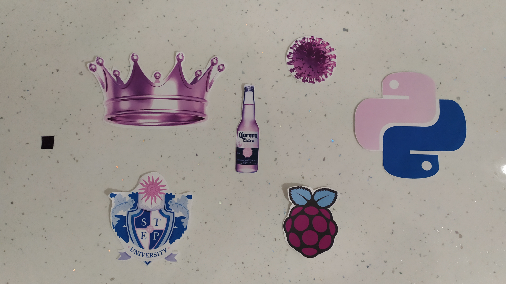
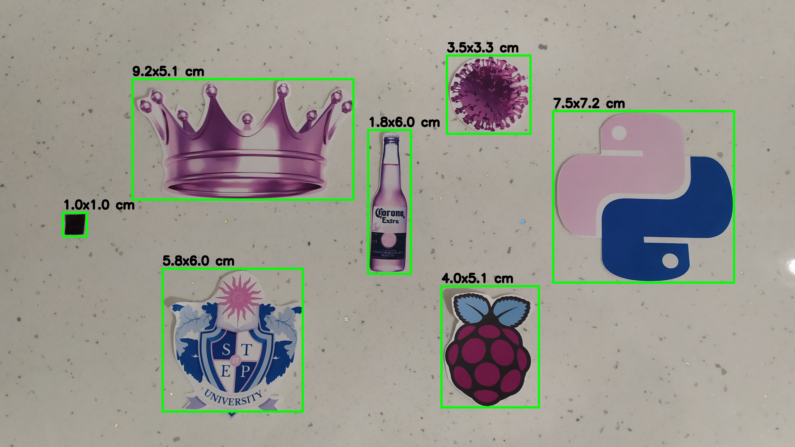

# Rulercam
Simple script to measure object sizes with OpenCV using reference object.

## Installation

```console
# Clone current repo
git clone https://github.com/VladMosiychuk/Rulercam.git

# Switch to project directory
cd Rulercam

# Create environment using conda
conda env create -f environment.yml

# Activate environment
conda activate rcenv
```

## Run script

```console
python main.py
```

The script will take input image `image.jpg`, detect objects and measure their sizes based on leftmost (reference) object.

</img>

As a result, you'll have image called `output.jpg` with bounding box and size for each object detected. 

</img>
